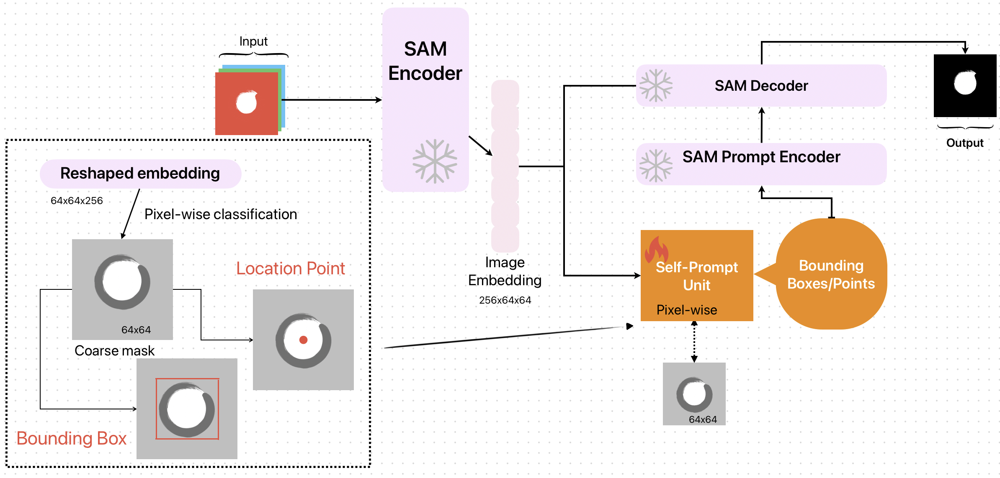

# Self-Prompting Large Vision Models for Few-Shot Medical Image Segmentation
## Introduction
This is the official repo for "Self-Prompting Large Vision Models for Few-Shot Medical Image Segmentation" to appear in MICCAI 2023 Workshop on [Domain Adaptation and Representation Transfer (DART)](https://sites.google.com/view/dart2023/home)


Recent advancements in large foundation models have shown promising potential in the medical industry due to their flexible prompting capability. One such model, the Segment Anything Model (SAM), a prompt-driven segmentation model, has shown remarkable performance improvements, surpassing state-of-the-art approaches in medical image segmentation. However, existing methods primarily rely on tuning strategies that require extensive data or prior prompts tailored to the specific task, making it particularly challenging when only a limited number of data samples are available. In this paper, we propose a novel perspective on self-prompting in medical vision applications. Specifically, we harness the embedding space of SAM to prompt itself through a simple yet effective linear pixel-wise classifier. By preserving the encoding capabilities of the large model, the contextual information from its decoder, and leveraging its interactive promptability, we achieve competitive results on multiple datasets (i.e. improvement of more than 15\% compared to fine-tuning the mask decoder using a few images).
## Requirements
The codes is tested on 
- Python 3.11.4
- PyTorch 2.0.1
- Nvidia GPU (RTX 3090) with CUDA version 11.7
1. First run ```conda env create -f environment.yml```
2. Packages for SAM ```pip install opencv-python pycocotools matplotlib onnxruntime onnx```
3. (Optional) We have already clone the SAM repo here. If not working, please follo the guidelines from the official repo of [Segment Anything](https://github.com/facebookresearch/segment-anything/tree/main),
```pip install git+https://github.com/facebookresearch/segment-anything.git```
4. Download the checkpoints of the ViT model for SAM and put it under ```./checkpoints```
- ```vit_b(default)```: [ViT-B SAM model](https://dl.fbaipublicfiles.com/segment_anything/sam_vit_b_01ec64.pth)
- ```vit_l```: [ViT-L SAM model](https://dl.fbaipublicfiles.com/segment_anything/sam_vit_l_0b3195.pth)
- ```vit_h```: [ViT-H SAM model](https://dl.fbaipublicfiles.com/segment_anything/sam_vit_h_4b8939.pth)
5. Download the dataset from the link [Kvasir-SEG](https://drive.google.com/file/d/1AFbMOHdiSrd1gsIbA0iQptYNApnp_l6b/view?usp=share_link)

## Usage
- To get the visualization (30) results: run ```python main.py --checkpoint <path/to/checkpoints/checkpoint> --model_type <model_type> --data_path <path/to/data> --k <num_of_training_images> --visualize True --visualize_num 30```
and then the results will be seen under ```./results```.
- To get the result for 5-fold validation: run ```python main.py --checkpoint <path/to/checkpoints/checkpoint> --model_type <model_type> --data_path <path/to/data> --k <num_of_training_images> --visualize False >> validation_result.txt```

